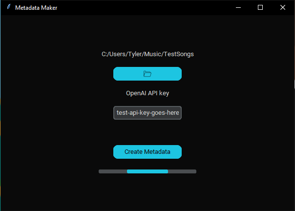

# **Youtube to MP3 Metadata fixer**

## Purpose

GUI created for fixing metadata for .mp3 files made from Youtube videos using OpenAI. This script will iterate through a folder of .mp3 files, use GPT3 to find an appropriate title and artist, update the metadata for the file, and then rename the file to match the title.

The user only need to point to the folder of .mp3 files they want to generate the metadata for and then provide their OpenAI API key.

## Technologies
 - Python (using tkinter for GUI)
 - OpenAI GPT3

## Screenshot
